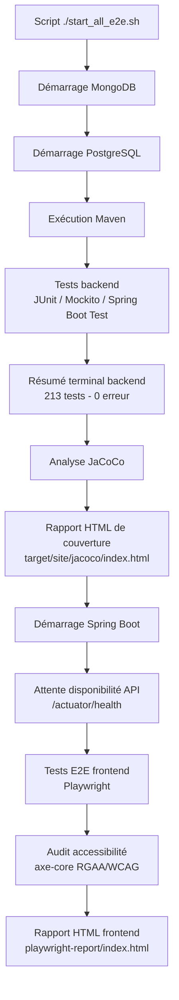

<!-- ```mermaid
flowchart TD
    A["Script ./start_all_e2e.sh"] --> B["Démarrage MongoDB"]
    B --> C["Démarrage PostgreSQL"]
    C --> D["Exécution Maven"]
    D --> E["Tests backend<br/>JUnit / Mockito / Spring Boot Test"]
    E --> F["Résumé terminal backend<br/>213 tests - 0 erreur"]
    F --> G["Analyse JaCoCo"]
    G --> H["Rapport HTML de couverture<br/>target/site/jacoco/index.html"]
    H --> I["Démarrage Spring Boot"]
    I --> J["Attente disponibilité API<br/>/actuator/health"]
    J --> K["Tests E2E frontend<br/>Playwright"]
    K --> L["Audit accessibilité<br/>axe-core RGAA/WCAG"]
    L --> M["Rapport HTML frontend<br/>playwright-report/index.html"]
``` -->



