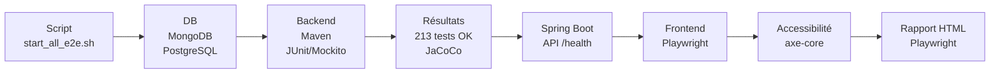

```mermaid
flowchart LR
    A["Script<br/>start_all_e2e.sh"] --> B["DB<br/>MongoDB<br/>PostgreSQL"]
    B --> C["Backend<br/>Maven<br/>JUnit/Mockito"]
    C --> D["Résultats<br/>213 tests OK<br/>JaCoCo"]

    E["Spring Boot<br/>API /health"] --> F["Frontend<br/>Playwright"]
    F --> G["Accessibilité<br/>axe-core"]
    G --> H["Rapport HTML<br/>Playwright"]

    D --> E
```
