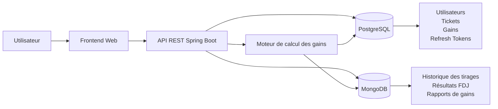

```mermaid
flowchart LR
    USER[Utilisateur] --> FRONT[Frontend Web]
    FRONT --> API[API REST Spring Boot]

    API --> PG[(PostgreSQL)]
    API --> MONGO[(MongoDB)]

    PG --> PGDATA[Utilisateurs<br/>Tickets<br/>Gains<br/>Refresh Tokens]
    MONGO --> MGDATA[Historique des tirages<br/>Résultats FDJ<br/>Rapports de gains]

    API --> CALC[Moteur de calcul des gains]
    CALC --> PG
    CALC --> MONGO
```
