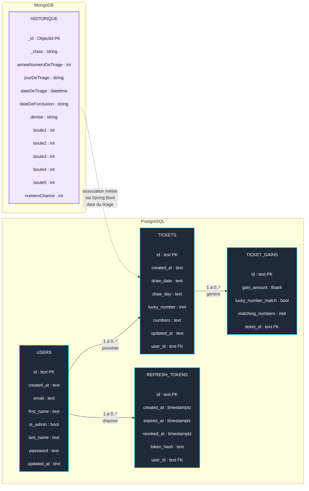

```mermaid
flowchart LR

    %% ===== MongoDB =====
    subgraph MONGO["MongoDB"]
        HIST["HISTORIQUE<br/><br/>
        _id : ObjectId PK<br/>
        _class : string<br/>
        anneeNumeroDeTirage : int<br/>
        jourDeTirage : string<br/>
        dateDeTirage : datetime<br/>
        dateDeForclusion : string<br/>
        devise : string<br/>
        boule1 : int<br/>
        boule2 : int<br/>
        boule3 : int<br/>
        boule4 : int<br/>
        boule5 : int<br/>
        numeroChance : int"]
    end

    %% ===== PostgreSQL =====
    subgraph PG["PostgreSQL"]
        USERS["USERS<br/><br/>
        id : text PK<br/>
        created_at : text<br/>
        email : text<br/>
        first_name : text<br/>
        is_admin : bool<br/>
        last_name : text<br/>
        password : text<br/>
        updated_at : text"]

        TICKETS["TICKETS<br/><br/>
        id : text PK<br/>
        created_at : text<br/>
        draw_date : text<br/>
        draw_day : text<br/>
        lucky_number : int4<br/>
        numbers : text<br/>
        updated_at : text<br/>
        user_id : text FK"]

        GAINS["TICKET_GAINS<br/><br/>
        id : text PK<br/>
        gain_amount : float4<br/>
        lucky_number_match : bool<br/>
        matching_numbers : int4<br/>
        ticket_id : text FK"]

        TOKENS["REFRESH_TOKENS<br/><br/>
        id : text PK<br/>
        created_at : timestamptz<br/>
        expires_at : timestamptz<br/>
        revoked_at : timestamptz<br/>
        token_hash : text<br/>
        user_id : text FK"]
    end

    %% ===== Relations PostgreSQL =====
    USERS -->|"1 à 0..*<br/>possède"| TICKETS
    USERS -->|"1 à 0..*<br/>dispose"| TOKENS
    TICKETS -->|"1 à 0..*<br/>génère"| GAINS

    %% ===== Association métier =====
    HIST -. "association métier<br/>via Spring Boot<br/>date du tirage" .-> TICKETS

    %% ===== Styles =====
    classDef pg fill:#1f2937,stroke:#0ea5e9,color:#ffffff,stroke-width:2px;
    classDef mongo fill:#f3e8ff,stroke:#8b5cf6,color:#111827,stroke-width:2px;
    class USERS,TICKETS,GAINS,TOKENS pg;
    class HIST mongo;
```
