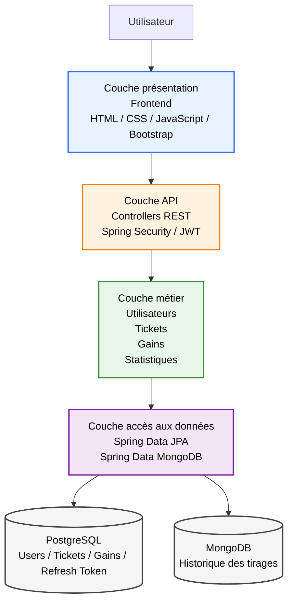

```mermaid
flowchart TD

    U[Utilisateur] --> FRONT[Couche présentation<br/>Frontend<br/>HTML / CSS / JavaScript / Bootstrap]

    FRONT --> API[Couche API<br/>Controllers REST<br/>Spring Security / JWT]

    API --> METIER[Couche métier<br/>Utilisateurs<br/>Tickets<br/>Gains<br/>Statistiques]

    METIER --> DATA[Couche accès aux données<br/>Spring Data JPA<br/>Spring Data MongoDB]

    DATA --> PG[(PostgreSQL<br/>Users / Tickets / Gains / Refresh Token)]
    DATA --> MDB[(MongoDB<br/>Historique des tirages)]

    classDef presentation fill:#E8F1FF,stroke:#2F6FED,stroke-width:2px,color:#000;
    classDef api fill:#FFF3E0,stroke:#F57C00,stroke-width:2px,color:#000;
    classDef metier fill:#E8F5E9,stroke:#388E3C,stroke-width:2px,color:#000;
    classDef data fill:#F3E5F5,stroke:#7B1FA2,stroke-width:2px,color:#000;
    classDef db fill:#F5F5F5,stroke:#424242,stroke-width:2px,color:#000;

    class FRONT presentation;
    class API api;
    class METIER metier;
    class DATA data;
    class PG,MDB db;
```
