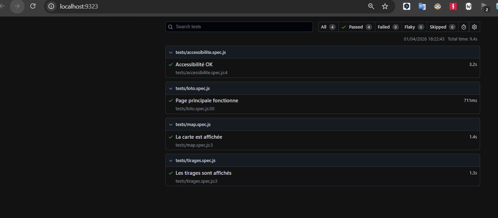
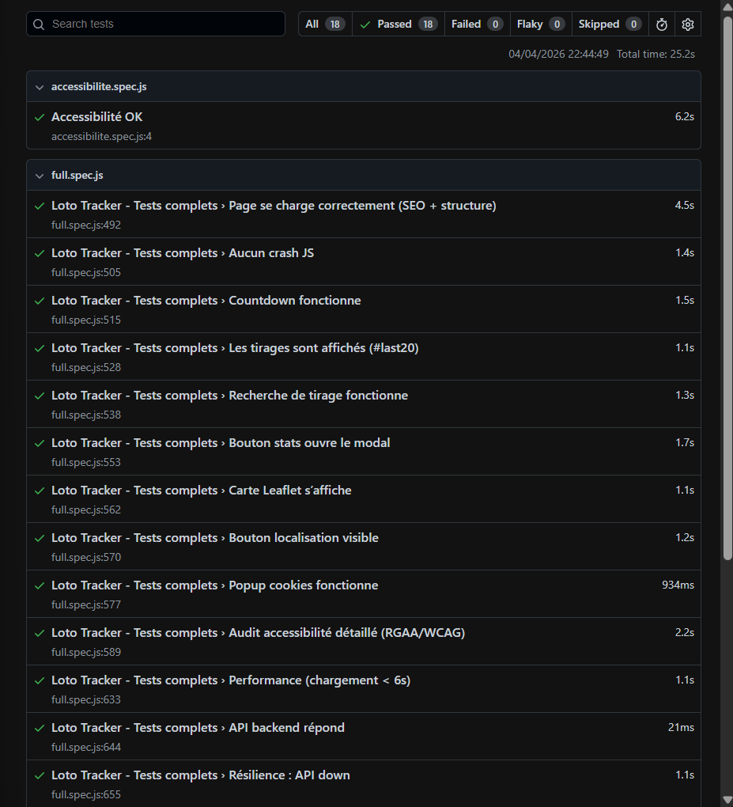

Parfait 👍 ton stack Spring Boot + HTML/CSS/JS est idéale pour faire du test statique propre (niveau RNCP6).

👉 Je vais te donner une stack simple + efficace + adaptée à TON projet (sans React).

🎯 🧠 Ce que tu dois mettre en place
🔹 1. Analyse statique JS (OBLIGATOIRE)

👉 avec ESLint

Installation :
npm init -y
npm install eslint --save-dev
npx eslint --init

👉 Choisis :

✔️ JavaScript
✔️ Browser
✔️ JSON config
🔹 2. Accessibilité statique (IMPORTANT)

👉 ajoute :

npm install eslint-plugin-jsx-a11y --save-dev

👉 même si tu n’es pas en React, tu peux utiliser des règles accessibilité

🔹 3. HTML validation

👉 outil simple :

HTMLHint
npm install htmlhint --save-dev
npx htmlhint .
🔹 4. CSS validation

👉 avec :

Stylelint
npm install stylelint stylelint-config-standard --save-dev
📊 Résultat = ton “Sonar frontend”

👉 Tu vas obtenir :

erreurs JS
erreurs HTML
erreurs CSS
problèmes accessibilité
📸 Exemple réel
4
⚙️ 5. Générer un rapport pour TON dashboard
ESLint JSON
npx eslint . -f json -o eslint-report.json
HTMLHint JSON
npx htmlhint . --format json > html-report.json
Stylelint JSON
npx stylelint "**/*.css" --formatter json > css-report.json
🔥 6. Connexion avec Spring Boot (ULTRA PRO)

👉 Tu fais un endpoint :

GET /api/frontend-quality

👉 qui lit les fichiers JSON :

{
  "jsErrors": 5,
  "jsWarnings": 12,
  "htmlIssues": 3,
  "cssIssues": 2
}
💻 7. Affichage dans TON dashboard

👉 comme ton JaCoCo :

🟢 JS OK
🔴 erreurs JS
🟡 warnings
♿ accessibilité

💥 Là tu fais un Sonar maison full stack

🧠 8. Bonus RNCP6 (très fort)

Ajoute :

SonarQube

👉 analyse globale :

backend Java
frontend JS/HTML/CSS


```bash
root@UID7E:/mnt/d/Users/steph/Documents/6ème trimestre/LOTO_API_v7# npm init -y
npm install eslint --save-dev
npx eslint --init
Wrote to /mnt/d/Users/steph/Documents/6ème trimestre/LOTO_API_v7/package.json:

{
  "dependencies": {
    "axios": "^1.7.9"
  },
  "name": "loto_api_v7",
  "version": "1.0.0",
  "description": "<!-- # LOTO API",
  "main": "index.js",
  "directories": {
    "doc": "docs"
  },
  "devDependencies": {
    "eslint": "^10.1.0"
  },
  "scripts": {
    "test": "echo \"Error: no test specified\" && exit 1"
  },
  "repository": {
    "type": "git",
    "url": "git+https://github.com/SDINAHET/LOTO_API_v7.git"
  },
  "keywords": [],
  "author": "",
  "license": "ISC",
  "bugs": {
    "url": "https://github.com/SDINAHET/LOTO_API_v7/issues"
  },
  "homepage": "https://github.com/SDINAHET/LOTO_API_v7#readme"
}


up to date, audited 92 packages in 1s

22 packages are looking for funding
  run `npm fund` for details

found 0 vulnerabilities
You can also run this command directly using 'npm init @eslint/config@latest'.

> loto_api_v7@1.0.0 npx
> create-config

@eslint/create-config: v1.11.0

✔ What do you want to lint? · javascript
✔ How would you like to use ESLint? · problems
✔ What type of modules does your project use? · esm
✔ Which framework does your project use? · none
✔ Does your project use TypeScript? · No / Yes
✔ Where does your code run? · browser
ℹ The config that you've selected requires the following dependencies:

eslint, @eslint/js, globals
✔ Would you like to install them now? · No / Yes
✔ Which package manager do you want to use? · npm
☕️Installing...

added 2 packages, and audited 94 packages in 1s

24 packages are looking for funding
  run `npm fund` for details

found 0 vulnerabilities
✔ Successfully created /mnt/d/Users/steph/Documents/6ème trimestre/LOTO_API_v7/eslint.config.mjs file.
root@UID7E:/mnt/d/Users/steph/Documents/6ème trimestre/LOTO_API_v7#
```

```bash
root@UID7E:/mnt/d/Users/steph/Documents/6ème trimestre/LOTO_API_v7# npm install eslint-plugin-jsx-a11y --save-dev
npm error code ERESOLVE
npm error ERESOLVE unable to resolve dependency tree
npm error
npm error While resolving: loto_api_v7@1.0.0
npm error Found: eslint@10.1.0
npm error node_modules/eslint
npm error   dev eslint@"^10.1.0" from the root project
npm error
npm error Could not resolve dependency:
npm error peer eslint@"^3 || ^4 || ^5 || ^6 || ^7 || ^8 || ^9" from eslint-plugin-jsx-a11y@6.10.2
npm error node_modules/eslint-plugin-jsx-a11y
npm error   dev eslint-plugin-jsx-a11y@"*" from the root project
npm error
npm error Fix the upstream dependency conflict, or retry
npm error this command with --force or --legacy-peer-deps
npm error to accept an incorrect (and potentially broken) dependency resolution.
npm error
npm error
npm error For a full report see:
npm error /root/.npm/_logs/2026-04-01T15_07_24_835Z-eresolve-report.txt
npm error A complete log of this run can be found in: /root/.npm/_logs/2026-04-01T15_07_24_835Z-debug-0.log
root@UID7E:/mnt/d/Users/steph/Documents/6ème trimestre/LOTO_API_v7#
```

🔥 Solution adaptée à TON projet
🟢 Accessibilité (sans React)

Utilise :

👉 HTMLHint
npm install htmlhint --save-dev

Puis :

npx htmlhint .

```bash
root@UID7E:/mnt/d/Users/steph/Documents/6ème trimestre/LOTO_API_v7# npx htmlhint src/

   Config loaded: /mnt/d/Users/steph/Documents/6ème trimestre/LOTO_API_v7/.htmlhintrc

Scanned 90 files, no errors found (255 ms).
root@UID7E:/mnt/d/Users/steph/Documents/6ème trimestre/LOTO_API_v7#
```
npm install -D playwright @axe-core/playwright start-server-and-test
npx playwright install

```bash
root@UID7E:/mnt/d/Users/steph/Documents/6ème trimestre/LOTO_API_v7# npm install -D playwright @axe-core/playwright start-server-and-test
npx playwright install

added 41 packages, and audited 156 packages in 39s

35 packages are looking for funding
  run `npm fund` for details

found 0 vulnerabilities
Downloading Chrome for Testing 147.0.7727.15 (playwright chromium v1217) from https://cdn.playwright.dev/builds/cft/147.0.7727.15/linux64/chrome-linux64.zip
170.4 MiB [====================] 100% 0.0s
Chrome for Testing 147.0.7727.15 (playwright chromium v1217) downloaded to /root/.cache/ms-playwright/chromium-1217
Downloading Chrome Headless Shell 147.0.7727.15 (playwright chromium-headless-shell v1217) from https://cdn.playwright.dev/builds/cft/147.0.7727.15/linux64/chrome-headless-shell-linux64.zip
112 MiB [====================] 100% 0.0s
Chrome Headless Shell 147.0.7727.15 (playwright chromium-headless-shell v1217) downloaded to /root/.cache/ms-playwright/chromium_headless_shell-1217
Downloading Firefox 148.0.2 (playwright firefox v1511) from https://cdn.playwright.dev/dbazure/download/playwright/builds/firefox/1511/firefox-ubuntu-22.04.zip
103.1 MiB [====================] 100% 0.0s
Firefox 148.0.2 (playwright firefox v1511) downloaded to /root/.cache/ms-playwright/firefox-1511
Downloading WebKit 26.4 (playwright webkit v2272) from https://cdn.playwright.dev/dbazure/download/playwright/builds/webkit/2272/webkit-ubuntu-22.04.zip
99.1 MiB [====================] 100% 0.0s
WebKit 26.4 (playwright webkit v2272) downloaded to /root/.cache/ms-playwright/webkit-2272
Playwright Host validation warning:
╔══════════════════════════════════════════════════════╗
║ Host system is missing dependencies to run browsers. ║
║ Missing libraries:                                   ║
║     libgtk-4.so.1                                    ║
║     libevent-2.1.so.7                                ║
║     libgstcodecparsers-1.0.so.0                      ║
║     libharfbuzz-icu.so.0                             ║
║     libmanette-0.2.so.0                              ║
║     libenchant-2.so.2                                ║
║     libGLESv2.so.2                                   ║
╚══════════════════════════════════════════════════════╝
    at validateDependenciesLinux (/mnt/d/Users/steph/Documents/6ème trimestre/LOTO_API_v7/node_modules/playwright-core/lib/server/registry/dependencies.js:269:9)
    at async Registry._validateHostRequirements (/mnt/d/Users/steph/Documents/6ème trimestre/LOTO_API_v7/node_modules/playwright-core/lib/server/registry/index.js:962:14)
    at async Registry._validateHostRequirementsForExecutableIfNeeded (/mnt/d/Users/steph/Documents/6ème trimestre/LOTO_API_v7/node_modules/playwright-core/lib/server/registry/index.js:1084:7)
    at async Registry.validateHostRequirementsForExecutablesIfNeeded (/mnt/d/Users/steph/Documents/6ème trimestre/LOTO_API_v7/node_modules/playwright-core/lib/server/registry/index.js:1073:7)
    at async installBrowsers (/mnt/d/Users/steph/Documents/6ème trimestre/LOTO_API_v7/node_modules/playwright-core/lib/cli/installActions.js:145:5)
    at async i.<anonymous> (/mnt/d/Users/steph/Documents/6ème trimestre/LOTO_API_v7/node_modules/playwright-core/lib/cli/program.js:63:5)
root@UID7E:/mnt/d/Users/steph/Documents/6ème trimestre/LOTO_API_v7#
```
npx playwright install-deps

sudo apt update
sudo apt install -y \
  libgtk-4-1 \
  libevent-2.1-7 \
  libgstreamer1.0-0 \
  libgstreamer-plugins-base1.0-0 \
  libharfbuzz-icu0 \
  libmanette-0.2-0 \
  libenchant-2-2 \
  libgles2

root@UID7E:/mnt/d/Users/steph/Documents/6ème trimestre/LOTO_API_v7# sudo apt update
sudo apt install -y \
  libgtk-4-1 \
  libevent-2.1-7 \
  libgstreamer1.0-0 \
  libgstreamer-plugins-base1.0-0 \
  libharfbuzz-icu0 \
  libmanette-0.2-0 \
  libenchant-2-2 \
  libgles2
Hit:1 http://security.ubuntu.com/ubuntu jammy-security InRelease
Hit:2 https://ppa.launchpadcontent.net/openjdk-r/ppa/ubuntu jammy InRelease
Hit:3 https://deb.nodesource.com/node_20.x nodistro InRelease
Hit:4 https://dl.google.com/linux/chrome/deb stable InRelease
Hit:5 http://archive.ubuntu.com/ubuntu jammy InRelease
Ign:6 https://storage.googleapis.com/download.dartlang.org/linux/debian stable InRelease
Get:7 https://dl.yarnpkg.com/debian stable InRelease
Hit:8 https://repo.mongodb.org/apt/ubuntu focal/mongodb-org/4.4 InRelease
Hit:9 http://archive.ubuntu.com/ubuntu jammy-updates InRelease
Hit:10 https://storage.googleapis.com/download.dartlang.org/linux/debian stable Release
Hit:11 http://archive.ubuntu.com/ubuntu jammy-backports InRelease
Err:7 https://dl.yarnpkg.com/debian stable InRelease
  The following signatures couldn't be verified because the public key is not available: NO_PUBKEY 62D54FD4003F6525
Hit:12 https://repo.mongodb.org/apt/ubuntu jammy/mongodb-org/8.0 InRelease
Reading package lists... Done
W: GPG error: https://dl.yarnpkg.com/debian stable InRelease: The following signatures couldn't be verified because the public key is not available: NO_PUBKEY 62D54FD4003F6525
E: The repository 'https://dl.yarnpkg.com/debian stable InRelease' is not signed.
N: Updating from such a repository can't be done securely, and is therefore disabled by default.
N: See apt-secure(8) manpage for repository creation and user configuration details.
Reading package lists... Done
Building dependency tree... Done
Reading state information... Done
libgstreamer1.0-0 is already the newest version (1.20.3-0ubuntu1.1).
libgstreamer1.0-0 set to manually installed.
The following additional packages will be installed:
  aspell aspell-en dictionaries-common enchant-2 hunspell-en-us libaspell15 libcairo-gobject2
  libcairo-script-interpreter2 libcairo2 libgtk-4-bin libgtk-4-common libhunspell-1.7-0
Suggested packages:
  aspell-doc spellutils wordlist hunspell openoffice.org-hunspell | openoffice.org-core libenchant-2-voikko
  libvisual-0.4-plugins gvfs libgtk-4-media-gstreamer | libgtk-4-media-ffmpeg
The following NEW packages will be installed:
  aspell aspell-en dictionaries-common enchant-2 hunspell-en-us libaspell15 libcairo-script-interpreter2
  libenchant-2-2 libevent-2.1-7 libgles2 libgtk-4-1 libgtk-4-bin libgtk-4-common libharfbuzz-icu0 libhunspell-1.7-0
  libmanette-0.2-0
The following packages will be upgraded:
  libcairo-gobject2 libcairo2 libgstreamer-plugins-base1.0-0
3 upgraded, 16 newly installed, 0 to remove and 92 not upgraded.
1 not fully installed or removed.
Need to get 8723 kB/9571 kB of archives.
After this operation, 26.1 MB of additional disk space will be used.
Get:1 http://security.ubuntu.com/ubuntu jammy-security/main amd64 libcairo-gobject2 amd64 1.16.0-5ubuntu2.1 [19.5 kB]
Get:2 http://archive.ubuntu.com/ubuntu jammy/main amd64 libaspell15 amd64 0.60.8-4build1 [325 kB]
Get:3 http://security.ubuntu.com/ubuntu jammy-security/main amd64 libcairo2 amd64 1.16.0-5ubuntu2.1 [628 kB]
Get:4 http://security.ubuntu.com/ubuntu jammy-security/main amd64 libcairo-script-interpreter2 amd64 1.16.0-5ubuntu2.1 [62.5 kB]
Get:5 http://archive.ubuntu.com/ubuntu jammy/main amd64 dictionaries-common all 1.28.14 [185 kB]
Get:6 http://archive.ubuntu.com/ubuntu jammy/main amd64 aspell amd64 0.60.8-4build1 [87.7 kB]
Get:7 http://archive.ubuntu.com/ubuntu jammy/main amd64 aspell-en all 2018.04.16-0-1 [299 kB]
Get:8 http://archive.ubuntu.com/ubuntu jammy/main amd64 hunspell-en-us all 1:2020.12.07-2 [280 kB]
Get:9 http://archive.ubuntu.com/ubuntu jammy/main amd64 libhunspell-1.7-0 amd64 1.7.0-4build1 [175 kB]
Get:10 http://archive.ubuntu.com/ubuntu jammy/main amd64 libenchant-2-2 amd64 2.3.2-1ubuntu2 [50.9 kB]
Get:11 http://archive.ubuntu.com/ubuntu jammy/main amd64 enchant-2 amd64 2.3.2-1ubuntu2 [13.0 kB]
Get:12 http://archive.ubuntu.com/ubuntu jammy/main amd64 libevent-2.1-7 amd64 2.1.12-stable-1build3 [148 kB]
Get:13 http://archive.ubuntu.com/ubuntu jammy-updates/main amd64 libgtk-4-common all 4.6.9+ds-0ubuntu0.22.04.2 [662 kB]
Get:14 http://archive.ubuntu.com/ubuntu jammy-updates/main amd64 libgtk-4-1 amd64 4.6.9+ds-0ubuntu0.22.04.2 [2866 kB]
Get:15 http://archive.ubuntu.com/ubuntu jammy-updates/main amd64 libgtk-4-bin amd64 4.6.9+ds-0ubuntu0.22.04.2 [2867 kB]
Get:16 http://archive.ubuntu.com/ubuntu jammy-updates/main amd64 libharfbuzz-icu0 amd64 2.7.4-1ubuntu3.2 [5890 B]
Get:17 http://archive.ubuntu.com/ubuntu jammy/main amd64 libmanette-0.2-0 amd64 0.2.6-3build1 [30.4 kB]
Get:18 http://archive.ubuntu.com/ubuntu jammy/main amd64 libgles2 amd64 1.4.0-1 [18.0 kB]
Fetched 8723 kB in 3s (3099 kB/s)
Preconfiguring packages ...
Selecting previously unselected package libaspell15:amd64.
(Reading database ... 119719 files and directories currently installed.)
Preparing to unpack .../00-libaspell15_0.60.8-4build1_amd64.deb ...
Unpacking libaspell15:amd64 (0.60.8-4build1) ...
Selecting previously unselected package dictionaries-common.
Preparing to unpack .../01-dictionaries-common_1.28.14_all.deb ...
Adding 'diversion of /usr/share/dict/words to /usr/share/dict/words.pre-dictionaries-common by dictionaries-common'
Unpacking dictionaries-common (1.28.14) ...
Selecting previously unselected package aspell.
Preparing to unpack .../02-aspell_0.60.8-4build1_amd64.deb ...
Unpacking aspell (0.60.8-4build1) ...
Selecting previously unselected package aspell-en.
Preparing to unpack .../03-aspell-en_2018.04.16-0-1_all.deb ...
Unpacking aspell-en (2018.04.16-0-1) ...
Selecting previously unselected package hunspell-en-us.
Preparing to unpack .../04-hunspell-en-us_1%3a2020.12.07-2_all.deb ...
Unpacking hunspell-en-us (1:2020.12.07-2) ...
Selecting previously unselected package libhunspell-1.7-0:amd64.
Preparing to unpack .../05-libhunspell-1.7-0_1.7.0-4build1_amd64.deb ...
Unpacking libhunspell-1.7-0:amd64 (1.7.0-4build1) ...
Selecting previously unselected package libenchant-2-2:amd64.
Preparing to unpack .../06-libenchant-2-2_2.3.2-1ubuntu2_amd64.deb ...
Unpacking libenchant-2-2:amd64 (2.3.2-1ubuntu2) ...
Selecting previously unselected package enchant-2.
Preparing to unpack .../07-enchant-2_2.3.2-1ubuntu2_amd64.deb ...
Unpacking enchant-2 (2.3.2-1ubuntu2) ...
Preparing to unpack .../08-libcairo-gobject2_1.16.0-5ubuntu2.1_amd64.deb ...
Unpacking libcairo-gobject2:amd64 (1.16.0-5ubuntu2.1) over (1.16.0-5ubuntu2) ...
Preparing to unpack .../09-libcairo2_1.16.0-5ubuntu2.1_amd64.deb ...
Unpacking libcairo2:amd64 (1.16.0-5ubuntu2.1) over (1.16.0-5ubuntu2) ...
Selecting previously unselected package libcairo-script-interpreter2:amd64.
Preparing to unpack .../10-libcairo-script-interpreter2_1.16.0-5ubuntu2.1_amd64.deb ...
Unpacking libcairo-script-interpreter2:amd64 (1.16.0-5ubuntu2.1) ...
Selecting previously unselected package libevent-2.1-7:amd64.
Preparing to unpack .../11-libevent-2.1-7_2.1.12-stable-1build3_amd64.deb ...
Unpacking libevent-2.1-7:amd64 (2.1.12-stable-1build3) ...
Preparing to unpack .../12-libgstreamer-plugins-base1.0-0_1.20.1-1ubuntu0.6_amd64.deb ...
Unpacking libgstreamer-plugins-base1.0-0:amd64 (1.20.1-1ubuntu0.6) over (1.20.1-1ubuntu0.5) ...
Selecting previously unselected package libgtk-4-common.
Preparing to unpack .../13-libgtk-4-common_4.6.9+ds-0ubuntu0.22.04.2_all.deb ...
Unpacking libgtk-4-common (4.6.9+ds-0ubuntu0.22.04.2) ...
Selecting previously unselected package libgtk-4-1:amd64.
Preparing to unpack .../14-libgtk-4-1_4.6.9+ds-0ubuntu0.22.04.2_amd64.deb ...
Unpacking libgtk-4-1:amd64 (4.6.9+ds-0ubuntu0.22.04.2) ...
Selecting previously unselected package libgtk-4-bin.
Preparing to unpack .../15-libgtk-4-bin_4.6.9+ds-0ubuntu0.22.04.2_amd64.deb ...
Unpacking libgtk-4-bin (4.6.9+ds-0ubuntu0.22.04.2) ...
Selecting previously unselected package libharfbuzz-icu0:amd64.
Preparing to unpack .../16-libharfbuzz-icu0_2.7.4-1ubuntu3.2_amd64.deb ...
Unpacking libharfbuzz-icu0:amd64 (2.7.4-1ubuntu3.2) ...
Selecting previously unselected package libmanette-0.2-0:amd64.
Preparing to unpack .../17-libmanette-0.2-0_0.2.6-3build1_amd64.deb ...
Unpacking libmanette-0.2-0:amd64 (0.2.6-3build1) ...
Selecting previously unselected package libgles2:amd64.
Preparing to unpack .../18-libgles2_1.4.0-1_amd64.deb ...
Unpacking libgles2:amd64 (1.4.0-1) ...
Setting up libharfbuzz-icu0:amd64 (2.7.4-1ubuntu3.2) ...
Setting up dictionaries-common (1.28.14) ...
Install emacsen-common for emacs
emacsen-common: Handling install of emacsen flavor emacs
Install dictionaries-common for emacs
install/dictionaries-common: Byte-compiling for emacsen flavour emacs
Setting up libaspell15:amd64 (0.60.8-4build1) ...
Setting up libmanette-0.2-0:amd64 (0.2.6-3build1) ...
Setting up libgstreamer-plugins-base1.0-0:amd64 (1.20.1-1ubuntu0.6) ...
Setting up libcairo2:amd64 (1.16.0-5ubuntu2.1) ...
Setting up libgles2:amd64 (1.4.0-1) ...
Setting up libevent-2.1-7:amd64 (2.1.12-stable-1build3) ...
Setting up aspell (0.60.8-4build1) ...
Setting up postfix (3.6.4-1ubuntu1.3) ...

Postfix (main.cf) configuration was not changed.  If you need to make changes,
edit /etc/postfix/main.cf (and others) as needed.  To view Postfix
configuration values, see postconf(1).

After modifying main.cf, be sure to run 'systemctl reload postfix'.

Running newaliases
newaliases: fatal: bad string length 0 < 1: mydomain =
dpkg: error processing package postfix (--configure):
 installed postfix package post-installation script subprocess returned error exit status 75
Setting up hunspell-en-us (1:2020.12.07-2) ...
Setting up libcairo-gobject2:amd64 (1.16.0-5ubuntu2.1) ...
Setting up libgtk-4-common (4.6.9+ds-0ubuntu0.22.04.2) ...
Setting up libhunspell-1.7-0:amd64 (1.7.0-4build1) ...
Setting up libcairo-script-interpreter2:amd64 (1.16.0-5ubuntu2.1) ...
Setting up libenchant-2-2:amd64 (2.3.2-1ubuntu2) ...
Setting up aspell-en (2018.04.16-0-1) ...
Setting up enchant-2 (2.3.2-1ubuntu2) ...
Processing triggers for libglib2.0-0:amd64 (2.72.4-0ubuntu2.9) ...
Processing triggers for libc-bin (2.35-0ubuntu3.13) ...
Processing triggers for man-db (2.10.2-1) ...
Processing triggers for postgresql-common (238) ...
Building PostgreSQL dictionaries from installed myspell/hunspell packages...
  en_us
Removing obsolete dictionary files:
Setting up libgtk-4-1:amd64 (4.6.9+ds-0ubuntu0.22.04.2) ...
Setting up libgtk-4-bin (4.6.9+ds-0ubuntu0.22.04.2) ...
Processing triggers for dictionaries-common (1.28.14) ...
aspell-autobuildhash: processing: en [en-common].
aspell-autobuildhash: processing: en [en-variant_0].
aspell-autobuildhash: processing: en [en-variant_1].
aspell-autobuildhash: processing: en [en-variant_2].
aspell-autobuildhash: processing: en [en-w_accents-only].
aspell-autobuildhash: processing: en [en-wo_accents-only].
aspell-autobuildhash: processing: en [en_AU-variant_0].
aspell-autobuildhash: processing: en [en_AU-variant_1].
aspell-autobuildhash: processing: en [en_AU-w_accents-only].
aspell-autobuildhash: processing: en [en_AU-wo_accents-only].
aspell-autobuildhash: processing: en [en_CA-variant_0].
aspell-autobuildhash: processing: en [en_CA-variant_1].
aspell-autobuildhash: processing: en [en_CA-w_accents-only].
aspell-autobuildhash: processing: en [en_CA-wo_accents-only].
aspell-autobuildhash: processing: en [en_GB-ise-w_accents-only].
aspell-autobuildhash: processing: en [en_GB-ise-wo_accents-only].
aspell-autobuildhash: processing: en [en_GB-ize-w_accents-only].
aspell-autobuildhash: processing: en [en_GB-ize-wo_accents-only].
aspell-autobuildhash: processing: en [en_GB-variant_0].
aspell-autobuildhash: processing: en [en_GB-variant_1].
aspell-autobuildhash: processing: en [en_US-w_accents-only].
aspell-autobuildhash: processing: en [en_US-wo_accents-only].
Processing triggers for libc-bin (2.35-0ubuntu3.13) ...
Errors were encountered while processing:
 postfix
E: Sub-process /usr/bin/dpkg returned an error code (1)
root@UID7E:/mnt/d/Users/steph/Documents/6ème trimestre/LOTO_API_v7#

root@UID7E:/mnt/d/Users/steph/Documents/6ème trimestre/LOTO_API_v7# npx playwright test
Error: No tests found

root@UID7E:/mnt/d/Users/steph/Documents/6ème trimestre/LOTO_API_v7#

🚀 Upgrade FINAL (niveau expert)

Si tu veux passer 🔥 niveau supérieur RNCP / entreprise :

🧾 1. Ajouter un rapport HTML automatique
npx playwright test --reporter=html

Puis :

npx playwright show-report


root@UID7E:/mnt/d/Users/steph/Documents/6ème trimestre/LOTO_API_v7# npx playwright test

Running 4 tests using 4 workers

  ✓  1 tests/map.spec.js:3:5 › La carte est affichée (1.4s)
  ✓  2 tests/loto.spec.js:30:5 › Page principale fonctionne (1.9s)
  ✓  4 tests/tirages.spec.js:3:5 › Les tirages sont affichés (1.2s)
     4 tests/tirages.spec.js:3:5 › Les tirages sont affichés
[
  {
    id: 'landmark-contentinfo-is-top-level',
    impact: 'moderate',
    tags: [ 'cat.semantics', 'best-practice' ],
    description: 'Ensure the contentinfo landmark is at top level',
    help: 'Contentinfo landmark should not be contained in another landmark',
    helpUrl: 'https://dequeuniversity.com/rules/axe/4.11/landmark-contentinfo-is-top-level?application=playwright',
    nodes: [ [Object] ]
  },
  {
    id: 'landmark-unique',
    impact: 'moderate',
    tags: [ 'cat.semantics', 'best-practice' ],
    description: 'Ensure landmarks are unique',
    help: 'Landmarks should have a unique role or role/label/title (i.e. accessible name) combination',
    helpUrl: 'https://dequeuniversity.com/rules/axe/4.11/landmark-unique?application=playwright',
    nodes: [ [Object] ]
  },
  {
    id: 'region',
    impact: 'moderate',
    tags: [ 'cat.keyboard', 'best-practice', 'RGAAv4', 'RGAA-9.2.1' ],
    description: 'Ensure all page content is contained by landmarks',
    help: 'All page content should be contained by landmarks',
    helpUrl: 'https://dequeuniversity.com/rules/axe/4.11/region?application=playwright',
    nodes: [ [Object], [Object], [Object] ]
  }
]
  ✓  3 tests/accessibilite.spec.js:4:5 › Accessibilité OK (2.6s)

  4 passed (8.8s)
root@UID7E:/mnt/d/Users/steph/Documents/6ème trimestre/LOTO_API_v7# npx playwright test --reporter=html

Running 4 tests using 4 workers
tests/accessibilite.spec.js:4:5 › Accessibilité OK
[
  {
    id: 'landmark-contentinfo-is-top-level',
    impact: 'moderate',
    tags: [ 'cat.semantics', 'best-practice' ],
    description: 'Ensure the contentinfo landmark is at top level',
    help: 'Contentinfo landmark should not be contained in another landmark',
    helpUrl: 'https://dequeuniversity.com/rules/axe/4.11/landmark-contentinfo-is-top-level?application=playwright',
    nodes: [ [Object] ]
  },
  {
    id: 'landmark-unique',
    impact: 'moderate',
    tags: [ 'cat.semantics', 'best-practice' ],
    description: 'Ensure landmarks are unique',
    help: 'Landmarks should have a unique role or role/label/title (i.e. accessible name) combination',
    helpUrl: 'https://dequeuniversity.com/rules/axe/4.11/landmark-unique?application=playwright',
    nodes: [ [Object] ]
  },
  {
    id: 'region',
    impact: 'moderate',
    tags: [ 'cat.keyboard', 'best-practice', 'RGAAv4', 'RGAA-9.2.1' ],
    description: 'Ensure all page content is contained by landmarks',
    help: 'All page content should be contained by landmarks',
    helpUrl: 'https://dequeuniversity.com/rules/axe/4.11/region?application=playwright',
    nodes: [ [Object], [Object], [Object] ]
  }
]
  4 passed (9.4s)

To open last HTML report run:

  npx playwright show-report

root@UID7E:/mnt/d/Users/steph/Documents/6ème trimestre/LOTO_API_v7# npx playwright show-report

  Serving HTML report at http://localhost:9323. Press Ctrl+C to quit.


http://localhost:9323/


Je te donne un script Node.js + Playwright + génération PDF propre
👉 que tu peux lancer dans ton CI/CD ou local.

🧾 🎯 OBJECTIF

Générer un fichier :

👉 accessibility-report.pdf
avec :

score global
violations RGAA
détails techniques
recommandations
🧠 📦 INSTALL
npm install pdfkit
🚀 🧾 SCRIPT COMPLET : generate-accessibility-pdf.js
import { chromium } from 'playwright';
import AxeBuilder from '@axe-core/playwright';
import PDFDocument from 'pdfkit';
import fs from 'fs';

const BASE_URL = 'http://localhost:5500';

// 🎯 Mapping RGAA
function mapRGAA(tags) {
  if (tags.includes('RGAA-9.2.1')) return 'RGAA 9.2.1 - Structuration des régions';
  if (tags.includes('cat.keyboard')) return 'RGAA Clavier';
  if (tags.includes('cat.semantics')) return 'RGAA Sémantique';
  return 'RGAA non précisé';
}

async function generateReport() {
  const browser = await chromium.launch();
  const page = await browser.newPage();

  await page.goto(BASE_URL);

  // accepter cookies si présents
  const popup = page.locator('#cookie-popup');
  if (await popup.isVisible()) {
    await page.click('#accept-cookies');
  }

  const results = await new AxeBuilder({ page }).analyze();

  const total = results.passes.length + results.violations.length;
  const score = Math.round((results.passes.length / total) * 100);

  // 📄 PDF
  const doc = new PDFDocument();
  doc.pipe(fs.createWriteStream('accessibility-report.pdf'));

  // 🔥 HEADER
  doc.fontSize(20).text('Audit Accessibilité - Loto Tracker', { align: 'center' });
  doc.moveDown();

  doc.fontSize(14).text(`Score global : ${score}%`);
  doc.moveDown();

  if (score >= 90) {
    doc.fillColor('green').text('Excellent niveau (RGAA compatible)');
  } else {
    doc.fillColor('red').text('Améliorations nécessaires');
  }

  doc.fillColor('black');
  doc.moveDown();

  // 📊 DÉTAILS
  if (results.violations.length === 0) {
    doc.text('Aucune violation détectée ✅');
  } else {
    results.violations.forEach((v, index) => {
      doc.moveDown();
      doc.fontSize(12).fillColor('red')
        .text(`❌ ${index + 1}. ${v.id}`);

      doc.fillColor('black')
        .text(`Règle : ${v.help}`)
        .text(`Impact : ${v.impact}`)
        .text(`RGAA : ${mapRGAA(v.tags)}`)
        .text(`Doc : ${v.helpUrl}`);

      v.nodes.forEach((node, i) => {
        doc.moveDown(0.5);
        doc.fontSize(10)
          .text(`Élément ${i + 1}:`)
          .text(node.html.replace(/\s+/g, ' ').substring(0, 200))
          .text(`Correction: ${node.failureSummary}`);
      });
    });
  }

  doc.end();

  await browser.close();

  console.log('✅ PDF généré : accessibility-report.pdf');
}

generateReport();
▶️ EXECUTION
node generate-accessibility-pdf.js
📄 RENDU FINAL

Ton PDF va contenir :

🟢 Header
Audit Accessibilité
Score (ex: 95%)
🔴 Violations
Nom règle (axe)
Correspondance RGAA
Impact
Code HTML concerné
Correction


webp
root@UID7E:/mnt/d/Users/steph/Documents/6ème trimestre/LOTO_API_v7# sudo apt install webp
Reading package lists... Done
Building dependency tree... Done
Reading state information... Done
The following additional packages will be installed:
  freeglut3
The following NEW packages will be installed:
  freeglut3 webp
0 upgraded, 2 newly installed, 0 to remove and 92 not upgraded.
1 not fully installed or removed.
Need to get 160 kB of archives.
After this operation, 632 kB of additional disk space will be used.
Do you want to continue? [Y/n] y
Get:1 http://archive.ubuntu.com/ubuntu jammy/universe amd64 freeglut3 amd64 2.8.1-6 [74.0 kB]
Get:2 http://archive.ubuntu.com/ubuntu jammy-updates/universe amd64 webp amd64 1.2.2-2ubuntu0.22.04.2 [86.3 kB]
Fetched 160 kB in 1s (301 kB/s)
Selecting previously unselected package freeglut3:amd64.
(Reading database ... 120180 files and directories currently installed.)
Preparing to unpack .../freeglut3_2.8.1-6_amd64.deb ...
Unpacking freeglut3:amd64 (2.8.1-6) ...
Selecting previously unselected package webp.
Preparing to unpack .../webp_1.2.2-2ubuntu0.22.04.2_amd64.deb ...
Unpacking webp (1.2.2-2ubuntu0.22.04.2) ...
Setting up freeglut3:amd64 (2.8.1-6) ...
Setting up postfix (3.6.4-1ubuntu1.3) ...

Postfix (main.cf) configuration was not changed.  If you need to make changes,
edit /etc/postfix/main.cf (and others) as needed.  To view Postfix
configuration values, see postconf(1).

After modifying main.cf, be sure to run 'systemctl reload postfix'.

Running newaliases
newaliases: fatal: bad string length 0 < 1: mydomain =
dpkg: error processing package postfix (--configure):
 installed postfix package post-installation script subprocess returned error exit status 75
Setting up webp (1.2.2-2ubuntu0.22.04.2) ...
Processing triggers for man-db (2.10.2-1) ...
Processing triggers for libc-bin (2.35-0ubuntu3.13) ...
Errors were encountered while processing:
 postfix
E: Sub-process /usr/bin/dpkg returned an error code (1)
root@UID7E:/mnt/d/Users/steph/Documents/6ème trimestre/LOTO_API_v7# cwebp -version
1.2.2
root@UID7E:/mnt/d/Users/steph/Documents/6ème trimestre/LOTO_API_v7# cd src/main/resources/static/assets/
img/
root@UID7E:/mnt/d/Users/steph/Documents/6ème trimestre/LOTO_API_v7/src/main/resources/static/assets/img#
 ls
admin-180.png  admin.png          loto_tracker.png   loto_tracker2.png  old_favicon-admin.ico
admin-32.png   favicon-admin.ico  loto_tracker1.png  loto_tracker3.png  swagger.png
root@UID7E:/mnt/d/Users/steph/Documents/6ème trimestre/LOTO_API_v7/src/main/resources/static/assets/img#
 ls -lh loto_tracker.png
-rwxrwxrwx 1 root root 1.9M Feb 18 02:33 loto_tracker.png
root@UID7E:/mnt/d/Users/steph/Documents/6ème trimestre/LOTO_API_v7/src/main/resources/static/assets/img#
 cwebp loto_tracker.png -o loto_tracker.webp -q 80
Saving file 'loto_tracker.webp'
File:      loto_tracker.png
Dimension: 1024 x 1024 (with alpha)
Output:    283560 bytes Y-U-V-All-PSNR 42.27 41.21 41.49   41.94 dB
           (2.16 bpp)
block count:  intra4:       2116  (51.66%)
              intra16:      1980  (48.34%)
              skipped:       766  (18.70%)
bytes used:  header:            525  (0.2%)
             mode-partition:  10817  (3.8%)
             transparency:   170591 (99.0 dB)
 Residuals bytes  |segment 1|segment 2|segment 3|segment 4|  total
    macroblocks:  |       8%|      15%|      30%|      47%|    4096
      quantizer:  |      27 |      25 |      21 |      15 |
   filter level:  |       8 |       6 |      14 |      25 |
Lossless-alpha compressed size: 170590 bytes
  * Header size: 825 bytes, image data size: 169765
  * Lossless features used: PREDICTION
  * Precision Bits: histogram=5 transform=5 cache=0
  * Palette size:   256
root@UID7E:/mnt/d/Users/steph/Documents/6ème trimestre/LOTO_API_v7/src/main/resources/static/assets/img#
 ls
admin-180.png  favicon-admin.ico  loto_tracker1.png  old_favicon-admin.ico
admin-32.png   loto_tracker.png   loto_tracker2.png  swagger.png
admin.png      loto_tracker.webp  loto_tracker3.png
root@UID7E:/mnt/d/Users/steph/Documents/6ème trimestre/LOTO_API_v7/src/main/resources/static/assets/img#
 convert loto_tracker.png -resize 300x loto_tracker_small.png
root@UID7E:/mnt/d/Users/steph/Documents/6ème trimestre/LOTO_API_v7/src/main/resources/static/assets/img#
 cwebp loto_tracker_small.png -o loto_tracker.webp -q 80
Saving file 'loto_tracker.webp'
File:      loto_tracker_small.png
Dimension: 300 x 300 (with alpha)
Output:    23964 bytes Y-U-V-All-PSNR 40.05 38.19 38.49   39.40 dB
           (2.13 bpp)
block count:  intra4:        227  (62.88%)
              intra16:       134  (37.12%)
              skipped:       120  (33.24%)
bytes used:  header:            300  (1.3%)
             mode-partition:   1321  (5.5%)
             transparency:     6006 (99.0 dB)
 Residuals bytes  |segment 1|segment 2|segment 3|segment 4|  total
    macroblocks:  |      23%|      27%|      21%|      28%|     361
      quantizer:  |      27 |      22 |      16 |      11 |
   filter level:  |       8 |       5 |       3 |       0 |
Lossless-alpha compressed size: 6005 bytes
  * Header size: 113 bytes, image data size: 5892
  * Precision Bits: histogram=5 transform=5 cache=0
  * Palette size:   256
root@UID7E:/mnt/d/Users/steph/Documents/6ème trimestre/LOTO_API_v7/src/main/resources/static/assets/img#
 ls -lh loto_tracker.webp
-rwxrwxrwx 1 root root 24K Apr  4 00:00 loto_tracker.webp
root@UID7E:/mnt/d/Users/steph/Documents/6ème trimestre/LOTO_API_v7/src/main/resources/static/assets/img#
 ls
admin-180.png  favicon-admin.ico  loto_tracker1.png  loto_tracker_small.png
admin-32.png   loto_tracker.png   loto_tracker2.png  old_favicon-admin.ico
admin.png      loto_tracker.webp  loto_tracker3.png  swagger.png
root@UID7E:/mnt/d/


npx playwright test
npx playwright test --headed
npx playwright show-report



